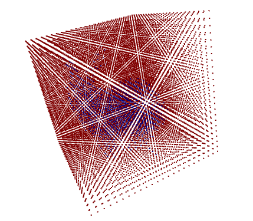

# mesh_to_sdfライブラリを3DCNN用のデータ作成のために変更したもの

### 詳細な使い方は``` './notebook.ipynb' ```に記載しています

使い方
```
import sys
sys.path.append("./mesh_to_sdf/")
from utils import scale_to_unit_sphere
from mesh_to_sdf import sample_sdf_voxel  # 新しく作成した関数

N = 24  # いくつの格子で区切るか
3d_obj_file_path = './sample-data/stanford_bunny.obj'

# 3次元データのload
mesh = trimesh.load(3d_obj_file_path)
mesh = scale_to_unit_sphere(mesh)

# 格子状の座標からSDFを計算
sdf_creator = sample_sdf_voxel(
    mesh,
    N=N,
    surface_point_method="scan",
    sign_method="normal",
    scan_count=100,
    scan_resolution=400,
    sample_point_count=10000000,
    normal_sample_count=200,
    min_size=0,
    return_gradients=False,
)
```

実行結果

